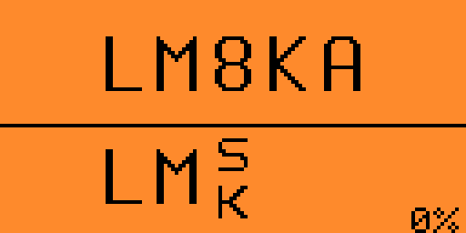
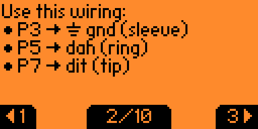
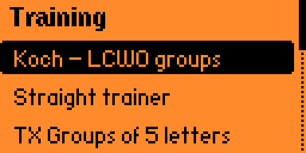
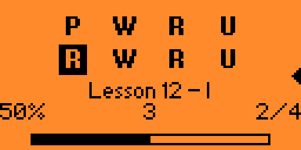
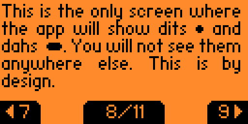
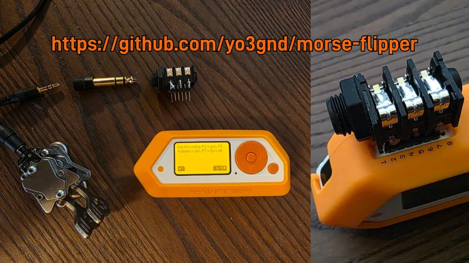
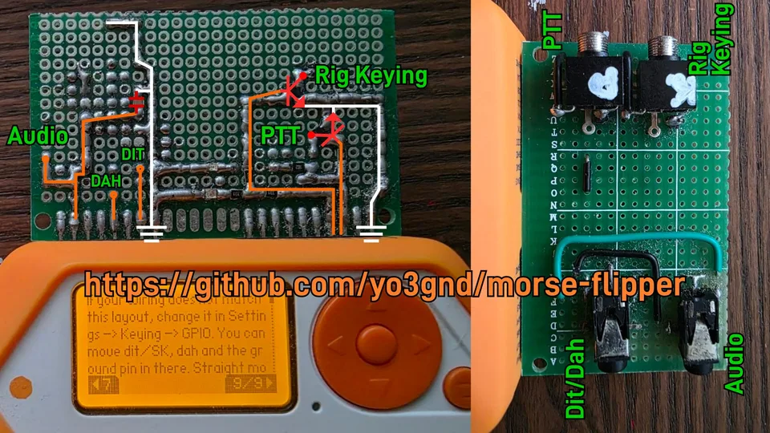

# Morse Flipper

Morse Flipper is a CW trainer, keyer, hardware adapter, portable ham helper, and Sub-GHz Morse experiment bench for the Flipper Zero. [Download version 0.1.76 here](https://github.com/yo3gnd/morse-flipper/releases/download/v0.1.76/morse_flipper.fap).

It is built around one opinion: do not learn Morse by staring at dots and dashes. Learn the sound. Hear the character, type the character, and keep the counting part of your brain out of it.

It works with nothing more than the Flipper buttons and internal speaker. Add a simple jack adapter and it becomes a real key/paddle interface. Add the bigger board and it can key a rig, drive PTT, output cleaner sidetone, and log a portable contact without needing a laptop balanced on a damp picnic table.

This started as a 2024 experiment, then got the proper launch-shape treatment in 2026. The important bits are still where they should be: timing, keying, GPIO behaviour, RF compromises, tests, and the stubborn refusal to make CW look like a barcode for the ears.

Morse Flipper also includes a fairly extensive help manual on the Flipper itself, under `Help`. It covers how to learn and practise Morse Code, how to connect straight keys and paddles, what is worth practising, and which outside resources are worth your time. Please read it; there is more useful Morse guidance in there than fits comfortably in a README.

The full Morse Flipper manual lives here: [manual/README.md](manual/README.md).

## 0.1.71 Hourglass Fix

Some users on both official and custom firmware saw the app get stuck forever on the startup hourglass. Version 0.1.71 fixes that nonsense.

## What it does

- Flipper-to-Flipper Sub-GHz Morse TX/RX, plus receive/decode experiments for compatible OOK Morse signals inside the Flipper's supported bands.
- Listening practice (LCWO/Koch progressions), straight-key timing practice, and five-character sending drills.
- Free practice with a straight key, paddle, Flipper buttons, USB, MIDI, mouse, or keyboard input.
- Built-in help for setup, hardware, practice, portable operating, contests, prepper use, and the bits of CW folklore that otherwise become pub arguments.
- Straight keys and paddles through either the Flipper joystick or a simple 6.5 mm jack adapter.
- Iambic, Elekey-A/B, Ultimatic, bug, keyahead, and hidden Vail compatibility modes for the more suspicious corners of keying behaviour.
- Flipper buttons as either a straight key or a usable paddle. Paddle mode uses OK and Back so your fingers are not forced into a silly little claw.
- A field keyer/logger for POTA/SOTA-style portable operating. Send canned replies like `UR 5NN HW?` or `P2P RO 0038`; if you send a callsign manually with paddles, it keys your rig and logs the text at the same time.
- Ham rig keying on GPIO, with `P15` as key and `P16` as PTT in Ham Keyer mode.
- Vail-style MIDI control, so the browser can talk back to the Flipper for speed, tone and keyer mode. It also means Vail-style browser games can use the Flipper as the adapter, which is tidier than buying another adapter.
- Smoother internal `Soft Buzz` sidetone, high-quality sinewave sidetone on `P2/A7`, plus square-wave buzzer and vibration fallback.
- A field-tested decoder, compact run history, saved settings, custom training character files on SD, and startup warnings for suspicious GPIO shorts.

It also falls back sensibly when a straight key is plugged into a stereo paddle jack, because that mistake is not hypothetical. Ask me how I know.

## Why another CW app?

       

There are already Flipper Morse apps, but many of them teach the most common bad habit first: looking at dots and dashes. That is fine for a code table and rubbish for copying real CW at speed.

Morse Flipper tries to train the useful reflex instead. Keep the character speed high, widen the gaps if needed, and let the sound become the letter. The app has a small Listening trainer because LCWO is still the gold standard for this approach, but the Flipper version is useful when the laptop is not.

The other half of the project is hardware. A Flipper is already a pocket full of GPIO, USB and RF mischief; this app turns that into a CW adapter, a paddle interface, a portable keyer, and a way to reuse old keys or scrap hardware without building a whole dedicated box first.

## Hardware

### None required

Morse Flipper works out of the box with no extra hardware. Use the joystick as a straight key, switch to the built-in keyers when you want paddle-style timing, hear smoother `Soft Buzz` sidetone on the internal speaker, and use the Flipper radio for short-range Morse experiments where that is legal and sensible. The adapters below make it nicer, sturdier, or more useful with real keys and rigs; they are comfort upgrades, not a hard requirement.

### Simple key and paddle jack

The simplest adapter is just a 6.5 mm female jack soldered to header pins. It plugs straight into the Flipper GPIO row and gives you a real key without a PCB. The header spacing is close enough to make the ugly version almost disappointingly easy.

Default wiring:

| Jack / key contact | Flipper GPIO |
| ------------------ | ------------ |
| Dit / straight key | `P7`         |
| Dah                | `P5`         |
| Ground             | `P3`         |

Why is ground `P3` and not `GND`/`P8`? Because the GPIO is assignable. Use whatever pins make sense for your key, and one pin can even pretend to be ground when that makes wiring simpler. `P3` is the default because a 6.5 mm audio jack lands neatly on every second header pin. Since that ground is under software control, the app can do useful little tricks, such as spotting `P5` and `P3` shorted together when a straight key has been shoved into a paddle jack, then falling back accordingly. If you prefer a real ground, use `GND`; the app will cope.

A small GPIO board / Flipper add-on board is in production (drop me a message if you want an early prototype!) but this ugly little jack adapter is the easy first build. It is cheap, obvious, and hard to debug incorrectly. You likely have the parts around your shack anyway.

### Expanded keyer board

 

The second board simply brings more Flipper GPIO out to sensible connectors: key input, sidetone audio, rig keying and PTT.

For audio, `P2/A7` carries the high quality sidetone. It is generated on a 256kHz square carrier, with the tone modulated as PWM, and it approximates a variable sinewave with fade-in and fade-out rather well. Tie the left and right contacts of a 6.5 mm audio jack together and feed them from `P2/A7`; use ground for the sleeve. Add a small `1-50µF` capacitor from the signal to ground if the carrier whine needs taming. You can probably skip the filter entirely, since most speakers will do enough of it for you. If you hear a constant high-pitched whine, your speaker does not filter it. Headphones are especially guilty of this.

For rig control, the keying outputs are simple low-side switches. A `BC817` NPN transistor shorts the rig signal to ground when the Flipper asserts the output: emitter to ground, collector to the rig key/PTT line, base driven from the Flipper GPIO through a resistor. Ham Keyer mode uses `P15` for key and `P16` for PTT. Check your rig first; if you do not know what the key/PTT line expects, add proper isolation rather than letting optimism be the smoke test. You may also want to avoid joining the rig ground and Flipper ground, or optocouple them. I did not isolate it on my FT-891, because I occasionally make choices future Richard has to inspect carefully.

## Learning CW

Small daily practice beats the grand weekly binge. Morse likes repetition, not theatre.

Start by copying by ear, not by diagram. If you catch yourself thinking `dash-dot-dash` and then deciding it is `K`, slow down the *gaps*, not the character. Farnsworth spacing exists for this reason. The letter should arrive as one sound.

Use the Flipper for quick sessions, pocket practice, button/key experiments and portable operating. Use Vail or V-Band when you want live humans to make things less tidy. Use a real key as soon as you can; the Flipper buttons work, but they are still rubber buttons on a toy dolphin.

## Code and engineering notes

This is not just a beep demo with a menu stapled on. The app has host-tested C cores for keying, CW token handling, training sessions, straight-key scoring, TX-group timing, RF timing helpers, GPIO rules, run-history layout, and the markdown-ish help renderer.

The firmware side uses stock Flipper `SceneManager` and `ViewDispatcher` flow, GPIO preflight checks for awkward key/paddle wiring, USB HID/MIDI modes, Sub-GHz RX/TX plumbing, and DMA-backed PWM sidetone on both the internal speaker and `P2/A7`. The tests run on the host, and the final FAP build still goes through the real Flipper toolchain. Not elegant everywhere, but honest, inspectable, and built to be carried rather than merely screenshotted.

I wanted the sidetone to be something you can live with for more than a minute: no sharp pops, less buzzer-like rasp, and no waveform chopped off mid-swing. The Flipper has neither a bipolar speaker supply nor an audio amp, so the shaped sidetone rides on a high-frequency PWM carrier. On startup the sampled outputs begin at their quiet midpoint instead of stepping there; each tone is shaped, and release waits for the virtual zero crossing instead of snapping the output off wherever it happens to be.

The help section is fairly comprehensive, which means reading plain text on a 128x64 screen became annoying almost immediately. There is a custom renderer involved now: scrolling text, inline formatting, best-effort justified text, and tiny inline icons for things the Flipper has no business typesetting, including `µ`, arrows and bullets. Full LaTeX support is almost ready.

## Build

Latest checked build: Flipper firmware 1.4.3 with fbt API 87.1.

## Notes

- RF TX is experimental and jurisdiction-dependent. Know what you are transmitting, where, and why.
- The Flipper radio is not a replacement for a proper HF CW rig. It is a useful emergency and experimentation path, not magic.
- Ham-rig keying deserves boring electrical caution. Verify levels, polarity and isolation before connecting to equipment you like.
- Some 2026 cleanup was LLM-assisted, but the design decisions and launch behaviour are human-reviewed, tested, and checked on real hardware.

Idea and prototype by Richard, YO3GND.
