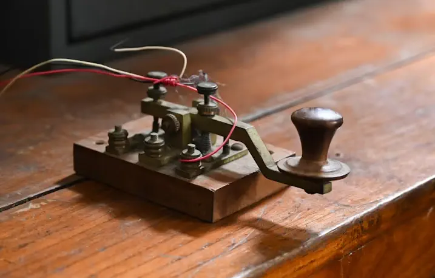
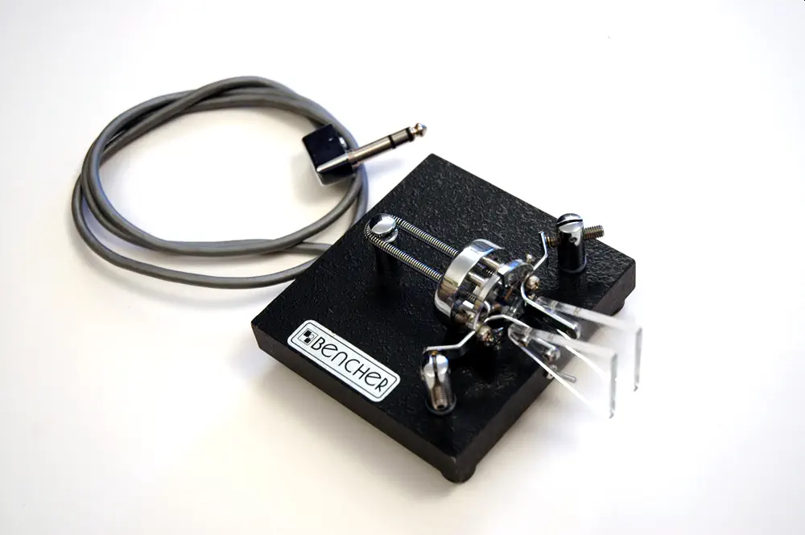
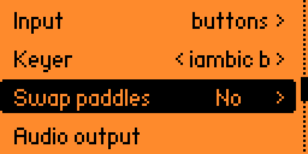
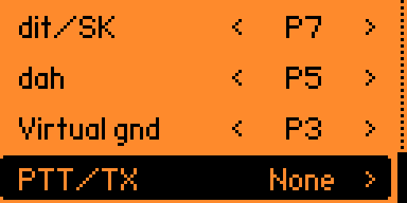

# Input Methods, Keys, And GPIO

Morse Flipper treats input and behaviour as separate problems: first where the keying comes from, then what the app does with it. The input may be Flipper buttons or a GPIO input (which can be a straight key or a paddle). The output may be local sidetone, USB, RF, an answer during practice, or an external rig in Ham Keyer mode.

Set the input from `Settings → Keying`.

## Choosing An Input Method

`Input` has three values:

- `buttons`: use the Flipper buttons as the key or paddles.
- `straight`: use an external straight key on GPIO.
- `paddle`: use an external paddle on GPIO.

The `Keyer` setting decides how paddle-like input is interpreted. A straight key is just a switch. A paddle gives the app dit and dah contacts, and the selected keyer turns those contacts into timed Morse elements.

Changing the input method does not, by itself, change audio, USB, RF, or training mode. It only changes where the app gets the keying events from. What happens next belongs to the screen you open: input fed to Training scenes are answers, Flipper Radio transmits with the Flipper, Ham Keyer drives a rig, and Free Practice just lets you key.

## Buttons

Button input is the safest first test because it needs no wiring.

With `Input` set to `buttons` and `Keyer` set to `straight`, hold `OK` to key. This is the same manual timing as a straight key, just with a small orange button instead of a lever.

With `Input` set to `buttons` and `Keyer` set to a paddle mode such as `iambic b`, `OK` and `Back` become the two paddles. Use `Swap paddles` if dit and dah feel backwards.

There is one awkward rule: when `Back` is acting as a paddle, it cannot also be Back. The app shows the escape hint on live screens: ⏴ long-press `Left` to leave.

## Straight Key

A straight key is one contact. Close it and the app keys; open it and it stops. All timing is yours, including the mistakes. That is the point. On the right is a straight key. You hold the knob and press down; the mechanism only sets travel, spring tension, and contact feel. Electrically, it is still just a switch closing.

External straight-key input uses the `dit/SK` GPIO pin and ground. With the default mapping, wire the key between:

- `P7` → input (contact)
- `P3` → virtual gnd

You can also use one of the Flipper's normal ground pins instead of the virtual gnd. In that case set virtual gnd to `None`, or leave it unused and make sure your wiring really does have ground. A key with one wire is a brick, not an input device. You do not need to wire any pull-up or pull-down resistors; Flipper does it internally. Idle is Hi-Z; active is short to ground.

Straight keying is used by Free Practice, Straight key trainer, groups-of-five sending drills, USB adapters, and transmit screens.

## Paddle

A paddle has separate dit and dah contacts. It is still just switches, but now the app can generate the timing for you. For most users, `iambic b` is the sensible default and the one to settle on early. The boring reason is compatibility: if a cheap rig says it has a keyer and does not say which one, assume `iambic b` until proven otherwise. On the right is a dual-lever paddle. Each side closes its own contact; the adjustments set travel, spacing, and spring feel. The keyer, the electronics rather than the paddle, makes the dits and dahs tidy.

With the default mapping, wire the paddle as:

- `P7` → dit
- `P5` → dah
- `P3` → virtual gnd

You do not need to wire any pull-up or pull-down resistors; Flipper does it internally. Idle is Hi-Z; active is short to ground.

If dit and dah feel the wrong way round, change `Swap paddles` before building muscle memory. Do not keep changing it every few sessions unless you enjoy teaching your hand nonsense.

You can read more about how keyers behave in [Keyers and paddle settings](101-keyers-and-paddle-settings.md).

## Default GPIO Wiring

The default layout is meant for a small TRS jack wired to the Flipper GPIO header:

- tip → `P7`, used for both dits in paddle mode and the contact in straight-key mode
- ring → `P5` → dah
- sleeve → `P3` → virtual gnd

That same jack can handle both common cases:

- paddle: tip, ring, and sleeve
- straight key: tip and sleeve

This keeps a straight key and a paddle on the same adapter. It is not clever electronics. It is just the least annoying pinout.

## Changing GPIO Pins

Open `Settings → Keying → GPIO`.

- `dit/SK`: dit input for paddles, and the straight-key input for straight mode.
- `dah`: dah input for paddles.
- `virtual gnd`: optional GPIO pin driven low so a jack can have its own ground contact.

These pins are outputs and are not negotiable:

- `Audio output`: it is always `P2`, and it is configured from [Audio sidetone](102-audio-sidetone.md). It is only available when high-quality sidetone is selected, and it cannot be assigned to other tasks.
- `PTT/TX`: used by Ham Keyer mode for radio control. It is asserted high when there is a message for the radio to send; it can be assigned to `P16` only, or disabled.
- `Keying output`: hardcoded to `P15` and cannot be changed. This is the Morse signal used to control a transceiver. You can also wire an LED between `P15` and GND, and it will blink in sync with this message.

`dit/SK`, `dah`, and `virtual gnd` must not overlap. The app will reject a conflicting setup instead of quietly saving cursed wiring. The GPIO screen offers the pins that make sense for this app. `P2` is kept for high-definition sidetone audio; `P15` and `P16` are reserved for keying an external rig in Ham Keyer mode.

## Mono Plug In A Paddle Jack

A mono straight-key plug in a stereo paddle jack shorts the ring (the middle connector) to the sleeve. Morse Flipper treats that as a useful signal: the paddle jack is probably being used with a straight key today. That fallback is there so one adapter can stay plugged in while you change keys. It is not a substitute for correct wiring. If the app reports a GPIO short circuit warning and this is not why, unplug the key and check the jack before blaming Morse, the Flipper, or the weather.

## Quick Checks

Start with the least interesting setup and add complexity only after it works.

1. Set `Input` to `buttons`, `Keyer` to `straight`, and check that `OK` keys.
2. Set `Input` to `straight`, connect the external key, and check that it keys only while pressed.
3. Set `Input` to `paddle`, connect the paddle, set `Keyer` to `iambic b`, and check dit and dah sides.
4. If the input is stuck down, check for a shared pin, a missing ground, or a mono plug being used where a paddle was expected.

## Troubleshooting

| What to check | Screen |
|---|---|
| Open `Settings → Keying` to choose the input source and keyer. This is where button, straight-key, and paddle input are selected before the practice or transmit screen uses them. |  |
| Open `Settings → Keying → GPIO` to confirm the pin mapping. The default wiring uses `P7` for `dit/SK`, `P5` for `dah`, and `P3` for `Virtual gnd`. |  |
