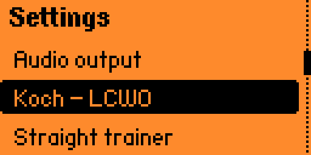
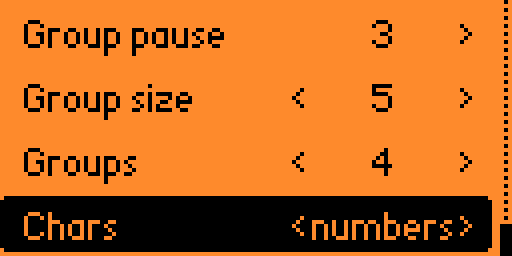

# Custom Lessons and Character Sets

The Koch trainer normally uses the built-in lesson order. This matches the LCWO.net order, so you can pick up on LCWO where you left off on the Flipper. Custom character sets let you replace that pool with your own rows: numbers, awkward letters, punctuation, or any small group you want to drill. In practice, each custom row behaves like a custom lesson.

Custom sets live in the app data folder on the SD card: `/ext/apps_data/morse_flipper/flipper-cw-custom-characters.txt`

The app creates the file if it is missing. The file is read when the app starts.

## File Format

Each line is one set:

```text
name=characters
```

The default file is:

```text
numbers=0123456789
dits=EISH5
more dits=EISH5AUVNDB
```

The name is what appears in settings. The characters are the pool used by the trainer. Keep them to Morse-supported characters: `A-Z`, `0-9`, and ordinary Morse punctuation such as `.`, `,`, `?`, `/`, and `=`. Lowercase letters work, but uppercase is clearer.

Limits are small: the first eight valid rows are loaded, names are short, and each character string is roughly one line. If a line has no `=`, no name, or no characters, it is ignored.

## Selecting a Set

Open `Settings → Listening` and change `Chars`.

- `lesson`: use the normal Koch lesson character pool.
- any custom name: use that row from `/ext/apps_data/morse_flipper/flipper-cw-custom-characters.txt`.

When `Chars` is a custom set, the `Lesson` row is not the character source; changing it will not change the prompt pool. It is kept for when you switch `Chars` back to `lesson`. The trainer title will show the custom set name instead.

## Example

| What to do | Screen |
|---|---|
| To choose a custom character set, start from the main menu and open `Settings → Listening`. This settings page is available directly when Morse Flipper starts, so there is no need to begin a training round first. The point of the exercise is simple: replace the normal LCWO lesson pool with a smaller pool, then let the trainer ask only from that pool. Not clever, but useful. |  |
| Move down to `Chars`. From the top of the settings list that is seven presses of `Down`, or one press of `Up` if you prefer to go the short way round. `Left` and `Right` change the selected character set. The default is `lesson`; press `Right` until the value is `<numbers>`. This selects the `numbers=0123456789` row from the SD-card file. |  |
| Now open `Training → Listening`. The trainer will draw prompts only from the selected set, so the exercise becomes numbers-only practice. If the training screen itself is unclear, start with [Listening practice](200-koch-listening-practice.md); the custom set only changes the pool of possible characters. |  |
| Repeat the same settings change and choose `more dits` instead of `numbers`. The third row on the practice screen reflects the active pool, here `EISH5AUVNDB`, so you can check at a glance whether the trainer is using the set you meant. Worth checking, because practising the wrong pool is still practice, just not the one you asked for. |  |
